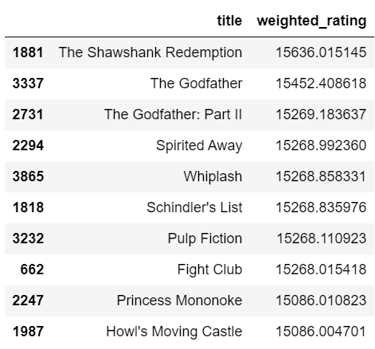
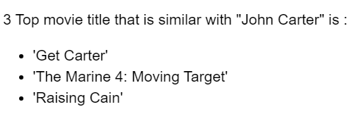
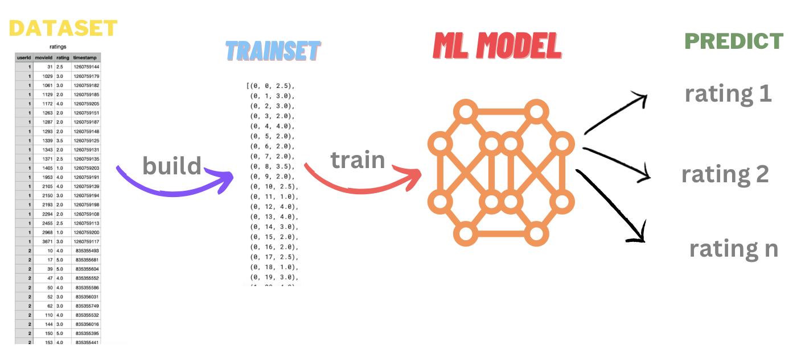
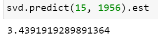

# Machine Learning Project Build a Movie Recommendation System

## Project Description

**Problem :**  
The Movie Recommendation System project aims to develop an intelligent system that suggests personalized movie recommendations to users based on their preferences and viewing history.

**Challenges :**  
Build a machine learning model that can recommend movie based on user preference.

## Project Goal

The Movie Recommendation System project aims to enhance the user experience by providing personalized movie recommendations.

## Tools & Library Used

 &nbsp;
 &nbsp;

## Project Result

[Click here to get full code](https://github.com/nickenshidqia/Build_a_Movie_Recommendation_System/blob/3b69fed8cfddc6ce7a44df75f10eb3633f117d87/Movie%20recommendation%20system.ipynb)

**3 Types of Recommendation System :**

1. Popularity based recommendation system  
   Recommend list of popular movie.  
   To get list of popular movie in this dataset, we calculate weighted rating, and here is the result :

   **Top 10 Popular Movie:**  
    

2. Content based filtering  
   When click certain movie, it will give recommendation of similar movie.  
   To get list of similar movie, we use Term Frequency & Inverse Document Frequency.  
   For example, we try to know 3 movies that is similar with movie title "John Carter" :  
   
3. Collaborative filtering  
   Predict what rating the user gonna give.  
   
   Example :  
    What rating of user 15 will give to movie id 1956?  
    

- The user with id 15 predicted will give ratings 3.49 to movie id 1956
- The ratings quite good because the rating ranges from 1 to 5.
